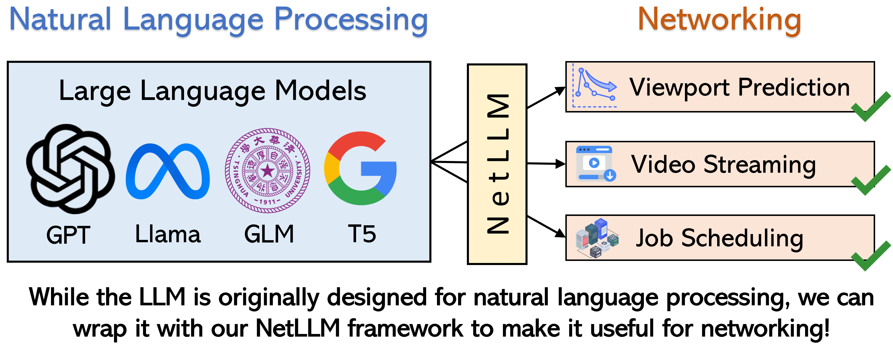
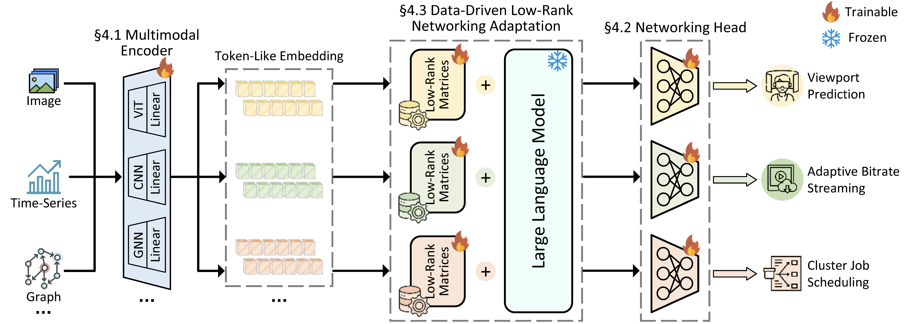
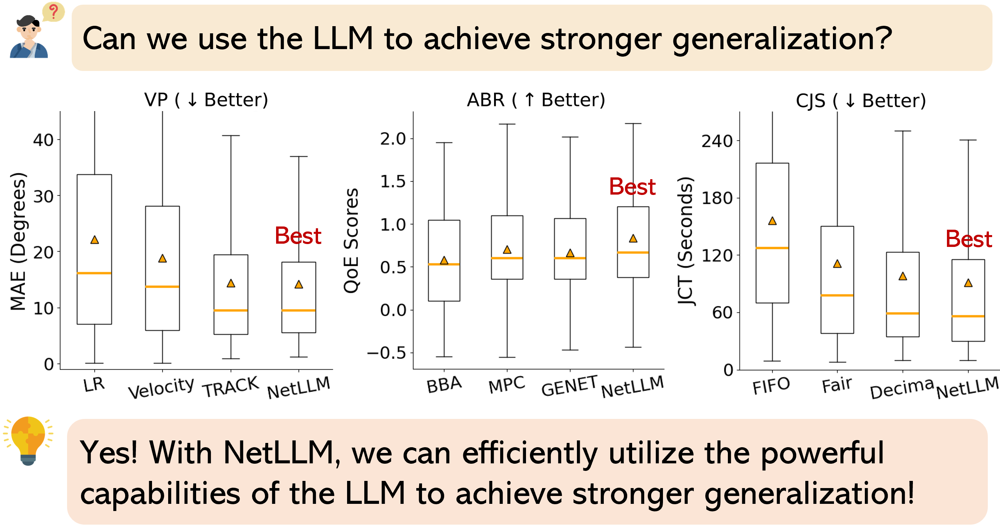
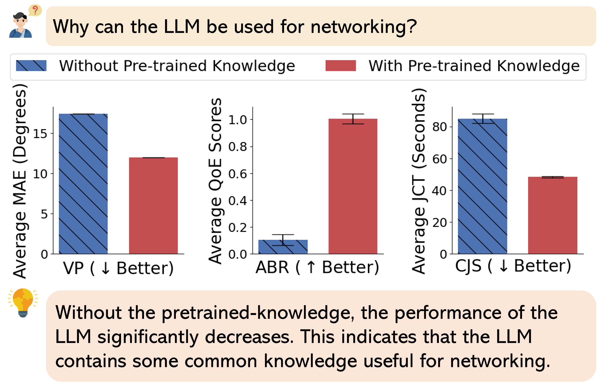
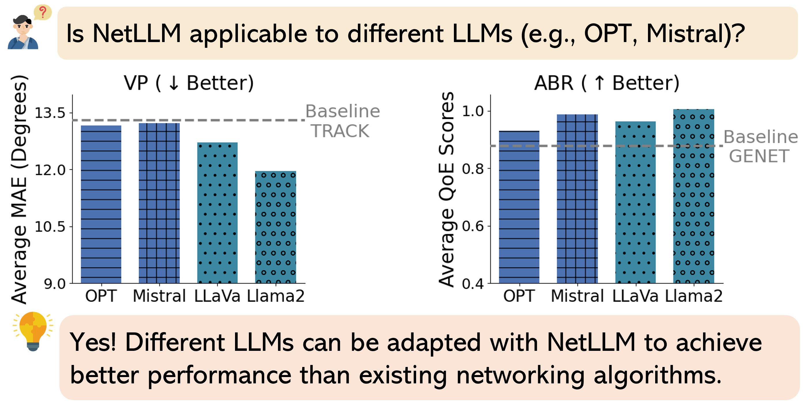

# NetLLM

Hi! This is the official repository of SIGCOMM 2024 paper "[NetLLM: Adapting Large Language Models for Networking](https://arxiv.org/abs/2402.02338)".

## Abstract

Many networking tasks now employ deep learning (DL) to solve complex prediction and optimization problems. However, current design philosophy of DL-based algorithms entails intensive engineering overhead due to the manual design of deep neural networks (DNNs) for different networking tasks. Besides, DNNs tend to achieve poor generalization performance on unseen data distributions/environments. 

Motivated by the recent success of large language models (LLMs), this work studies the LLM adaptation for networking to explore a more sustainable design philosophy. With the powerful pre-trained knowledge, the LLM is promising to serve as the foundation model to achieve “one model for all tasks” with even better performance and stronger generalization. In pursuit of this vision, we present NetLLM, the first framework that provides a coherent design to harness the powerful capabilities of LLMs with low efforts to solve networking problems. Specifically, NetLLM empowers the LLM to effectively process multimodal data in networking and efficiently generate task-specific answers. Besides, NetLLM drastically reduces the costs of fine-tuning the LLM to acquire domain knowledge for networking. Across three networking-related use cases - viewport prediction, adaptive bitrate streaming and cluster job scheduling, we showcase that the NetLLM-adapted LLM significantly outperforms state-of-the-art algorithms.

## Overview

**NetLLM** **is the first framework that provides a coherent design to utilize the powerful capabilities of LLMs to solve various networking tasks with low efforts.** It includes the following three design components:

- **Multimodal encoder:** Enabling the LLM to understand the multimodal information in networking effectively.
- **Networking head:** Enabling the LLM to generate answers for networking efficiently.
- **Data-driven low-rank networking adaptation (DD-LRNA):** Enabling the LLM to learn domain-specific knowledge for networking efficiently, based on data-driven reinforcement learning and parameter-efficient fine-tune.

## Evaluation & Insights

By default, we use Llama2-7B as the LLM and then use NetLLM to adapt it for three networking-related tasks: VP, ABR and CJS. We then compare the NetLLM-adapted Llama2 with three other state-of-the-art algorithms on each task. 

## Contributors

[Duo Wu](https://duowuyms.github.io/), [Xianda Wang](https://github.com/wangxiandabetter), [Yaqi Qiao](https://github.com/qyqyq77)

## Citation

If you find this repository useful, please cite our paper:

> @inproceedings{wu2024netllm,
>
> ​      author = {Wu, Duo and Wang, Xianda and Qiao, Yaqi and Wang, Zhi and Jiang, Junchen and Cui, Shuguang and Wang, Fangxin},
>
> ​      title = {NetLLM: Adapting Large Language Models for Networking},
>
> ​      year = {2024},
>
> ​      publisher = {Association for Computing Machinery},
>
> ​      address = {New York, NY, USA},
>
> ​      doi = {10.1145/3651890.3672268},
>
> ​      booktitle = {Proceedings of the ACM SIGCOMM 2024 Conference},
>
> ​      pages = {661–678},
>
> ​      numpages = {18},
>
> ​      location = {Sydney, NSW, Australia},
>
> ​      series = {ACM SIGCOMM '24}
> }